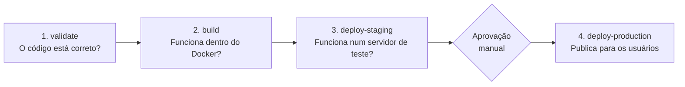
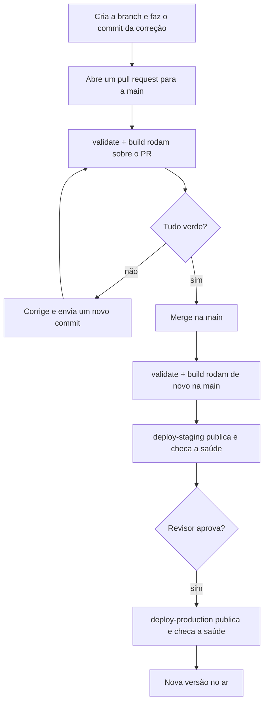

# Entendendo o pipeline de CI/CD

Este documento explica, passo a passo e em linguagem simples, como funciona o pipeline de CI/CD do projeto **Bolsa Valores**: tudo o que acontece desde o momento em que alguém altera o código até a nova versão estar no ar, em produção.

O pipeline inteiro está em um único arquivo: [`.github/workflows/pipeline.yml`](.github/workflows/pipeline.yml). Ao longo do texto, cada parte desse arquivo é mostrada e explicada.

---

## 1. Primeiro: o que é CI/CD?

- **CI — Integração Contínua (_Continuous Integration_)**: toda vez que o código muda, um "robô" baixa o projeto, compila, roda os testes e verifica a qualidade. Se algo quebrou, ele avisa na hora, **antes** de a mudança entrar na branch principal.
- **CD — Entrega Contínua (_Continuous Delivery_)**: depois que o código passou em todas as verificações, o robô publica a nova versão nos servidores, sem ninguém precisar fazer isso à mão.

> **Analogia:** pense numa linha de montagem com postos de inspeção. Cada peça (cada commit) passa por vários postos. Se for reprovada em qualquer um deles, sai da linha e nunca chega ao cliente.

Neste projeto:

| Papel | Ferramenta |
|---|---|
| O "robô" que executa o pipeline | **GitHub Actions** |
| Onde a aplicação fica hospedada | **Render** |
| Como a aplicação é empacotada | **Docker** |
| Como o projeto Java é compilado e testado | **Maven** |

---

## 2. Visão geral: o caminho de uma mudança

O pipeline tem **4 etapas** (chamadas de _jobs_), e elas rodam **uma depois da outra**:



| Job | Pergunta que ele responde | Roda em pull request? | Roda na `main`? |
|---|---|---|---|
| `validate` | O código compila, passa nos testes e segue as regras de qualidade? | ✅ Sim | ✅ Sim |
| `build` | A aplicação empacotada em Docker realmente liga e responde? | ✅ Sim | ✅ Sim |
| `deploy-staging` | A nova versão sobe e funciona num servidor real de testes? | ❌ Não | ✅ Sim |
| `deploy-production` | A nova versão sobe e funciona para os usuários? | ❌ Não | ✅ Sim, após aprovação |

**Regra de ouro:** cada job só começa se o anterior terminou com sucesso. Se o `validate` falhar, o `build` nem começa; se o `build` falhar, nada é publicado, e assim por diante. Código com problema fica barrado no primeiro posto que o detectar.

---

## 3. Vocabulário mínimo do GitHub Actions

Antes de ler o arquivo, vale conhecer cinco termos:

| Termo | O que significa | Onde aparece no arquivo |
|---|---|---|
| **Workflow** | O pipeline inteiro, descrito num arquivo `.yml` dentro de `.github/workflows/` | o arquivo todo |
| **Evento (gatilho)** | O acontecimento que faz o workflow começar | `on:` |
| **Job** | Um bloco de trabalho que roda numa máquina própria | `jobs:` |
| **Step** | Um passo dentro do job: um comando (`run:`) ou uma ação pronta (`uses:`) | `steps:` |
| **Runner** | A máquina virtual temporária onde o job roda | `runs-on: ubuntu-latest` |

Um detalhe importante: **cada job ganha uma máquina nova e vazia**, que é destruída quando ele termina. Por isso os jobs não compartilham arquivos entre si, e cada um precisa baixar o código de novo no início.

---

## 4. O cabeçalho: configurações gerais do pipeline

### 4.1 Gatilhos: quando o pipeline roda

```yaml
on:
  pull_request:
    branches:
      - main
  push:
    branches:
      - main
```

O pipeline dispara em duas situações:

1. **Quando um pull request para a `main` é aberto ou atualizado.** Aqui o objetivo é só **verificar** a mudança (rodam `validate` e `build`). Nesse caso, o GitHub testa o código como ele ficaria **depois** do merge, e não apenas a branch isolada.
2. **Quando algo chega na `main`** (normalmente, o merge de um pull request). Aqui roda **tudo**, incluindo os deploys.

Um push em outra branch qualquer, sem pull request aberto, não dispara nada.

### 4.2 Permissões: o mínimo necessário

```yaml
permissions:
  contents: read
```

O GitHub entrega ao pipeline uma chave de acesso temporária ao repositório. Esta linha limita essa chave a **somente leitura**. Se algum passo fosse comprometido, ele não conseguiria alterar o código nem criar releases. É o **princípio do menor privilégio**: dar a cada parte só o acesso de que ela precisa.

### 4.3 Concorrência: evitando execuções repetidas

```yaml
concurrency:
  group: bolsa-valores-${{ github.event.pull_request.number || github.ref }}
  cancel-in-progress: ${{ github.event_name == 'pull_request' }}
```

- `group` agrupa as execuções: todas as de um mesmo pull request ficam num grupo, e todas as da `main` ficam em outro.
- `cancel-in-progress` define o que acontece quando chega uma execução nova no mesmo grupo:
  - **Em pull request:** a execução antiga é **cancelada**. Se você enviar 3 commits seguidos, só o último importa, e isso economiza tempo.
  - **Na `main`:** a execução antiga **não é cancelada**; a nova espera na fila. Interromper um deploy no meio do caminho poderia deixar o servidor num estado inconsistente.

### 4.4 Variáveis globais

```yaml
env:
  RENDER_CLI_VERSION: '2.28.0'
```

Fixa a versão da ferramenta de linha de comando do Render usada nos deploys. Com a versão fixa, o pipeline se comporta igual hoje e daqui a seis meses, mesmo que a ferramenta lance versões novas.

---

## 5. Job 1 — `validate`: "o código está correto?"

```yaml
validate:
  name: Validate application
  runs-on: ubuntu-latest
  timeout-minutes: 20
  steps:
    - name: Checkout repository
      uses: actions/checkout@v7
    - name: Set up Java 21
      uses: actions/setup-java@v6
      with:
        distribution: temurin
        java-version: '21'
        cache: maven
    - name: Run tests, coverage and static analysis
      run: ./mvnw -B -ntp clean verify
```

É o primeiro posto de inspeção. `timeout-minutes: 20` garante que, se algo travar, o job é encerrado em vez de ficar rodando para sempre.

### Passo 1: Checkout

Baixa o código do repositório para dentro da máquina virtual, que começa vazia.

### Passo 2: Instalar o Java 21

Instala o JDK 21 (distribuição Temurin), a mesma versão exigida pelo projeto no `pom.xml`. A opção `cache: maven` guarda as bibliotecas baixadas pelo Maven de uma execução para a outra: na primeira vez o download é demorado, mas nas seguintes ele é reaproveitado.

### Passo 3: `./mvnw -B -ntp clean verify`

Este é **o coração do CI**. Cada parte do comando:

| Parte | Significado |
|---|---|
| `./mvnw` | **Maven Wrapper**: baixa e usa exatamente a versão do Maven definida no projeto (3.9.16). Assim a mesma versão roda na máquina do desenvolvedor, no CI e no Docker. |
| `-B` | _Batch mode_: modo não interativo, próprio para robôs. |
| `-ntp` | _No transfer progress_: não imprime as barras de progresso de download, o que deixa o log mais limpo. |
| `clean` | Apaga a pasta `target/` para começar do zero. |
| `verify` | Executa todas as fases do Maven até a fase `verify`. |

Esse único comando dispara, em ordem, todas estas verificações (configuradas no [`pom.xml`](pom.xml)):

| Ordem | O que acontece | Ferramenta | O job falha se... |
|---|---|---|---|
| 1 | Compila o código | Java (`javac`) | houver erro de compilação |
| 2 | Roda todos os testes automatizados | JUnit 5 + Spring Boot Test | algum teste falhar |
| 3 | Gera o arquivo `.jar` da aplicação | Spring Boot Maven Plugin | houver erro no empacotamento |
| 4 | Mede quanto do código foi exercitado pelos testes | **JaCoCo** | a cobertura de linhas for **menor que 60%** |
| 5 | Confere o padrão de escrita do código | **Checkstyle** | alguma regra de estilo for violada |
| 6 | Procura padrões conhecidos de bug | **SpotBugs** | encontrar bug de prioridade média ou alta |

Em mais detalhes:

- **Testes:** há testes **unitários** (dos adapters da NASDAQ e da BOVESPA e da regra de notificação no `MercadoService`) e testes de **integração**, que sobem a aplicação Spring e fazem requisições HTTP simuladas aos endpoints, incluindo o `/actuator/health`.
- **JaCoCo (cobertura):** enquanto os testes rodam, o JaCoCo anota quais linhas foram executadas. No fim, se menos de 60% das linhas foram cobertas, o build é reprovado. Isso impede que entre muito código sem nenhum teste.
- **Checkstyle (estilo):** as regras estão em [`config/checkstyle/checkstyle.xml`](config/checkstyle/checkstyle.xml). Exemplos: proíbe `import java.util.*`, imports não usados, `if` sem chaves, linhas com mais de 140 caracteres e nomes fora da convenção Java.
- **SpotBugs (análise estática):** examina o código compilado **sem executá-lo**, procurando erros clássicos, como comparar `String` com `==` ou um possível `NullPointerException`.

> **Dica:** o desenvolvedor pode rodar exatamente a mesma verificação na própria máquina, antes de abrir o pull request:
>
>     ./mvnw clean verify

---

## 6. Job 2 — `build`: "a aplicação funciona empacotada?"

```yaml
build:
  name: Build and test Docker image
  needs: validate
```

`needs: validate` cria a dependência: este job **só começa se o `validate` passou**.

Passar nos testes não garante que a aplicação vai funcionar no servidor. O `Dockerfile` pode estar quebrado, o `.jar` pode ter outro nome, a porta pode estar errada... Este job **ensaia o que o servidor vai fazer**: constrói a imagem Docker, liga o container e confere se ele responde.

### Passo 1: Checkout

Novo job, nova máquina vazia: é preciso baixar o código de novo.

### Passo 2: Construir a imagem Docker

```yaml
run: docker build --tag bolsa-valores:${{ github.sha }} .
```

Constrói a imagem a partir do [`Dockerfile`](Dockerfile). A imagem recebe como etiqueta (_tag_) o **SHA do commit**, o código único que identifica aquela versão exata do código.

#### Como o Dockerfile funciona

O Dockerfile usa um **build em dois estágios** (_multi-stage_). Pense em uma cozinha e um prato: o primeiro estágio é a cozinha, cheia de ferramentas; o segundo é só o prato pronto que vai para a mesa.

```
┌─────────────────────────────────────┐       ┌───────────────────────────────┐
│ Estágio 1: build (JDK completo)     │       │ Estágio 2: runtime (só JRE)   │
│                                     │       │                               │
│ 1. copia mvnw e pom.xml             │       │ 1. cria usuário "app" sem     │
│ 2. baixa as dependências            │ .jar  │    privilégios de admin       │
│ 3. copia o código-fonte (src/)      │ ────▶ │ 2. copia SÓ o .jar            │
│ 4. gera o .jar (sem rodar testes)   │       │ 3. roda como "app", porta 8080│
└─────────────────────────────────────┘       └───────────────────────────────┘
       é descartado no final                        é a imagem final
```

Por que fazer assim:

- **Imagem menor e mais segura:** a imagem final não carrega código-fonte, Maven nem compilador, só o Java necessário para rodar e o `.jar`.
- **Build mais rápido:** as dependências são baixadas **antes** de copiar o código. Se só o código mudou, o Docker reaproveita a camada de dependências que já estava pronta.
- **`-DskipTests`:** os testes não rodam de novo aqui porque o job `validate` já cuidou disso.
- **Usuário sem privilégios:** a aplicação não roda como `root`. Se alguém invadir o container, terá poderes limitados.

O arquivo [`.dockerignore`](.dockerignore) impede que pastas desnecessárias ou sensíveis (`.git`, `target`, arquivos `.env` com segredos, configurações de IDE) sejam enviadas para o build.

### Passo 3: Ligar o container

```yaml
docker run --detach --name bolsa-valores-ci --env PORT=8080 --publish 8080:8080 bolsa-valores:<sha>
```

- `--detach`: roda em segundo plano, liberando o pipeline para seguir aos próximos passos.
- `--env PORT=8080`: a aplicação lê a porta dessa variável (`server.port=${PORT:8080}` no [`application.properties`](src/main/resources/application.properties)). É a mesma variável que o Render usa no servidor real.
- `--publish 8080:8080`: liga a porta 8080 da máquina à porta 8080 do container, para que o `curl` consiga acessá-lo.

### Passo 4: Checar a saúde do container (_health check_)

```yaml
curl --fail --silent --show-error --retry 10 --retry-delay 2 --retry-connrefused --retry-all-errors \
  http://127.0.0.1:8080/actuator/health | jq --exit-status '.status == "UP"'
```

O **Spring Boot Actuator** oferece o endpoint `/actuator/health`, que responde `{"status":"UP"}` quando a aplicação está saudável. Este passo pergunta "você está vivo?" para o container:

- A aplicação leva alguns segundos para ligar. Por isso o `curl` **tenta até 10 vezes**, esperando 2 segundos entre as tentativas, inclusive quando a conexão é recusada porque o servidor ainda não subiu.
- `--fail`: trata respostas de erro HTTP (4xx e 5xx) como falha.
- `jq --exit-status '.status == "UP"'`: lê o JSON da resposta. Se o `status` não for `UP`, o `jq` termina com erro e o passo falha.

### Passo 5: Teste de fumaça da integração NASDAQ (_smoke test_)

```yaml
curl ... --request POST --data '{"movement":"UNCHANGED"}' http://127.0.0.1:8080/api/integracoes/nasdaq/eventos
  | jq --exit-status '.bolsa == "NASDAQ" and .variacao == "SEM_ALTERACAO" and (.clientesNotificados | length == 0)'
```

Envia um evento de verdade para a API que está rodando dentro do container e confere a resposta:

| Verificação | O que ela prova |
|---|---|
| `bolsa == "NASDAQ"` | O endpoint da NASDAQ respondeu |
| `variacao == "SEM_ALTERACAO"` | O `NasdaqAdapter` traduziu o formato da NASDAQ (`UNCHANGED`) para o modelo interno |
| `clientesNotificados` vazio | A regra de negócio foi aplicada: sem alteração no mercado, ninguém é notificado |

> **Por que "teste de fumaça"?** O nome vem da eletrônica: você liga o aparelho e vê se sai fumaça. Não é um teste completo (isso já foi feito no `validate`), é só uma confirmação rápida de que o essencial funciona no ambiente real.

### Passo 6: Remover o container

```yaml
if: ${{ always() && steps.start-container.outcome == 'success' }}
run: docker rm --force bolsa-valores-ci
```

É a faxina. `always()` faz o passo rodar **mesmo que um passo anterior tenha falhado**, e a segunda condição garante que só se tenta remover o container se ele chegou a ser criado.

> **Importante:** a imagem construída neste job **não é enviada para lugar nenhum**. Ela serve apenas como ensaio. Quem publica a aplicação é o Render, que constrói a própria imagem a partir do **mesmo Dockerfile** e do **mesmo commit**.

---

## 7. Job 3 — `deploy-staging`: "funciona num servidor de verdade?"

```yaml
deploy-staging:
  name: Deploy to staging
  if: github.event_name == 'push' && github.ref == 'refs/heads/main'
  needs: build
  environment: staging
```

**Staging** (ou homologação) é uma cópia do ambiente de produção onde a nova versão é testada antes de chegar aos usuários. É o **ensaio geral antes da estreia**.

Três linhas importantes:

- `if: ...`: este job **só roda em push na `main`**. Em um pull request, ele aparece como "pulado" (_skipped_). Assim, só código que já foi aprovado e mergeado é publicado.
- `needs: build`: só começa se a imagem Docker passou no ensaio.
- `environment: staging`: liga o job ao **GitHub Environment** chamado `staging`. É de lá que vêm as senhas e configurações específicas desse ambiente, e é lá que ficam as regras de proteção (por exemplo, só aceitar deploy vindo da `main`).

### Passo 1: Instalar a CLI do Render

Baixa do GitHub a versão fixa (`2.28.0`) da ferramenta de linha de comando do Render, descompacta e instala em `/usr/local/bin/render`, para que o comando `render` fique disponível.

### Passo 2: Publicar o commit em staging

```yaml
env:
  CI: 'true'
  RENDER_API_KEY: ${{ secrets.RENDER_API_KEY }}
  RENDER_SERVICE_ID: ${{ vars.RENDER_SERVICE_ID }}
run: render deploys create "${RENDER_SERVICE_ID}" --commit "${GITHUB_SHA}" --wait --confirm
```

| Item | Para que serve |
|---|---|
| `RENDER_API_KEY` (**secret**) | A "senha" que autoriza o pipeline a mexer na conta do Render. Fica guardada criptografada no GitHub e aparece como `***` nos logs. |
| `RENDER_SERVICE_ID` (**variable**) | Diz **qual** serviço do Render publicar: neste job, o serviço de staging. |
| `CI: 'true'` | Avisa à ferramenta que ela está rodando num ambiente automatizado, sem ninguém digitando. |
| `--commit "${GITHUB_SHA}"` | Publica **exatamente o commit que foi testado**, e não "o que estiver na `main` agora". |
| `--wait` | Espera o deploy terminar. Se ele falhar no Render, este passo também falha. |
| `--confirm` | Pula a pergunta "tem certeza?", já que não há ninguém para responder. |

> **Secret × Variable:** _secrets_ são valores sigilosos (senhas, chaves) que o GitHub esconde nos logs. _Variables_ são configurações comuns, que não precisam ser escondidas (IDs, URLs).

Ao receber o pedido, o **Render** baixa o código daquele commit, roda o `docker build` com o mesmo Dockerfile, liga o container novo, confere se ele responde em `/actuator/health` e só então troca a versão antiga pela nova.

### Passo 3: Checar a saúde de staging

```yaml
curl ... --retry 10 --retry-delay 5 --retry-all-errors "${APP_BASE_URL%/}/actuator/health" | jq --exit-status '.status == "UP"'
```

É o mesmo teste de saúde do job `build`, mas agora **pela internet**, na URL pública de staging (`APP_BASE_URL`). A diferença é esperar 5 segundos entre as tentativas, porque o plano gratuito do Render "adormece" o serviço quando ele fica sem uso, e ele pode demorar um pouco para acordar.

O trecho `${APP_BASE_URL%/}` remove uma barra `/` no final da URL, se houver, para não gerar um endereço com barra dupla (`...onrender.com//actuator/health`).

---

## 8. Job 4 — `deploy-production`: publicando para os usuários

```yaml
deploy-production:
  name: Deploy to production
  if: github.event_name == 'push' && github.ref == 'refs/heads/main'
  needs: deploy-staging
  environment: production
```

Os passos são **idênticos** aos de staging: instalar a CLI, publicar o commit e checar a saúde. O que muda são duas coisas, e nenhuma delas está escrita nos passos:

1. **Os valores das variáveis.** Como o job usa `environment: production`, o `RENDER_SERVICE_ID` e o `APP_BASE_URL` vêm do ambiente de produção e apontam para o serviço e a URL de produção. É **a mesma receita com ingredientes diferentes**: o mesmo código YAML publica em lugares diferentes dependendo do _environment_.
2. **A aprovação manual.** O ambiente `production` foi configurado no GitHub (em _Settings → Environments_) para exigir um **revisor**. Quando o pipeline chega aqui, ele **pausa** com o status _Waiting_ até que alguém abra a execução em _Actions_, clique em **Review deployments** e depois em **Approve and deploy**.

Essa aprovação é o que torna este pipeline de **Entrega Contínua** (_Continuous Delivery_): tudo é automático até a porta da produção, mas quem decide abrir essa porta é uma pessoa. Se não houvesse aprovação e tudo fosse publicado direto, seria **Implantação Contínua** (_Continuous Deployment_).

---

## 9. Exemplo completo, de ponta a ponta

Imagine que você corrigiu um bug no `NasdaqAdapter`. Veja tudo o que acontece:



1. **Você cria uma branch** (ex.: `fix/nasdaq`), faz o commit e o push. Nada roda ainda.
2. **Você abre um pull request para a `main`.** O pipeline dispara e roda `validate` e `build`. Os jobs de deploy aparecem como "pulados".
3. **Se algo falhar** (um teste, a cobertura, o Checkstyle...), o pull request mostra um ❌ vermelho. Você lê o log, corrige e envia um novo commit. A execução antiga é cancelada e uma nova começa.
4. **Com tudo verde ✅, você faz o merge.** O merge é um push na `main`, que dispara o pipeline de novo.
5. **`validate` e `build` rodam outra vez**, agora sobre o código final da `main`, que pode incluir mudanças de outros pull requests mergeados nesse meio-tempo. É isso que garante que **o que vai para o servidor foi exatamente o que foi testado**.
6. **`deploy-staging`** publica o commit no Render e confere a saúde de [bolsa-valores-staging.onrender.com](https://bolsa-valores-staging.onrender.com/actuator/health).
7. **O pipeline pausa** esperando aprovação. Nesse intervalo, você pode testar staging à mão, por exemplo pelo Swagger.
8. **Você aprova.** O `deploy-production` publica o mesmo commit e confere a saúde de [bolsa-valores-production.onrender.com](https://bolsa-valores-production.onrender.com/actuator/health).
9. **Todos os jobs verdes:** a correção está no ar para os usuários.

---

## 10. E quando algo falha?

| Onde falhou | O que acontece | Como investigar |
|---|---|---|
| `validate` | Nada mais roda. Nenhuma imagem é criada e nada é publicado. | Leia o log do job e reproduza localmente com `./mvnw clean verify`. |
| `build` | Os deploys não rodam. | Reproduza com `docker build -t bolsa-valores .` e `docker run -p 8080:8080 bolsa-valores`. |
| `deploy-staging` | Produção não recebe nada e continua na versão anterior. | Veja os logs do deploy no painel do Render. |
| `deploy-production` | Se o deploy falhar no Render, o serviço continua rodando a última versão que funcionava. | Veja os logs no Render e, se preciso, faça o rollback. |

Se uma versão com defeito chegar à produção, o procedimento de **rollback** (voltar para a versão anterior) está descrito na seção _Rollback_ do [README](README.md#rollback). Em resumo: o caminho preferido é fazer um `git revert` do commit defeituoso e deixá-lo passar pelo pipeline normalmente.

---

## 11. Resumo final

| | Pull request para `main` | Push / merge na `main` |
|---|---|---|
| Objetivo | Verificar a mudança antes de aceitá-la | Publicar a mudança aceita |
| `validate` | ✅ roda | ✅ roda |
| `build` | ✅ roda | ✅ roda |
| `deploy-staging` | ⏭️ pulado | ✅ roda automaticamente |
| `deploy-production` | ⏭️ pulado | ⏸️ espera aprovação, depois roda |
| Execuções antigas | São canceladas quando chega uma nova | Esperam na fila, nunca são canceladas |

**Em uma frase:** todo código passa por testes, verificações de qualidade e um ensaio em Docker; só o que chega à `main` é publicado em staging; e só vai para produção depois que uma pessoa aprova.
