# API Bolsa de Valores

API REST que recebe eventos das bolsas NASDAQ e BOVESPA e notifica os clientes de acordo com a variação do mercado.

Regra de negócio:

- ALTA: todos os clientes são notificados
- BAIXA: somente os clientes PREMIUM são notificados
- SEM_ALTERACAO: nenhum cliente é notificado

## Como rodar

Pré-requisito: Java 21. O Maven será executado pelo Wrapper incluído no projeto.

Para iniciar a aplicação:

    ./mvnw spring-boot:run

A aplicação sobe em http://localhost:8080

Ao abrir a raiz no navegador, é exibido o painel web. O Swagger continua disponível em http://localhost:8080/swagger-ui.html.

Para rodar os testes:

    ./mvnw test

## Interface web

O painel Thymeleaf em `/` permite:

- simular eventos nos formatos da NASDAQ e da BOVESPA;
- visualizar quais clientes foram notificados;
- acompanhar e limpar o histórico de notificações;
- acessar o Swagger pelo botão **Abrir Swagger**.

A interface reutiliza os mesmos adapters e o mesmo serviço dos endpoints REST. O histórico é mantido apenas em memória e é reiniciado quando a aplicação é reiniciada ou uma nova instância é publicada.

## Endpoints

Cada bolsa tem o seu próprio endpoint, porque cada uma envia mensagens em um formato diferente.

NASDAQ:

    POST /api/integracoes/nasdaq/eventos

    { "movement": "UP" }

Valores aceitos: UP, DOWN, UNCHANGED

BOVESPA:

    POST /api/integracoes/bovespa/eventos

    { "variacao": "ALTA" }

Valores aceitos: ALTA, BAIXA, SEM_ALTERACAO

A resposta informa quais clientes foram notificados:

    {
      "bolsa": "NASDAQ",
      "variacao": "ALTA",
      "clientesNotificados": [
        { "nome": "João", "tipo": "COMUM" },
        { "nome": "Maria", "tipo": "PREMIUM" }
      ]
    }

As notificações também aparecem no console da aplicação:

    Notificando João: NASDAQ está em alta.
    Notificando Maria: NASDAQ está em alta.

## Explicação arquitetural

O fluxo das duas bolsas é o mesmo:

    NASDAQ  -> NasdaqController  -> NasdaqAdapter  -> EventoMercado -> MercadoService -> notificação
    BOVESPA -> BovespaController -> BovespaAdapter -> EventoMercado -> MercadoService -> notificação

Os dois caminhos convergem para o mesmo serviço, então a regra de negócio existe em um lugar só e não fica duplicada.

Camadas:

controller: pontos de entrada HTTP. Cada bolsa tem o seu, porque cada uma tem um contrato próprio. O controller não tem regra de negócio, apenas recebe a requisição, chama o adapter e devolve o resultado.

dto: os contratos externos, no formato em que cada bolsa envia. A NASDAQ manda o campo movement com valores em inglês, a BOVESPA manda o campo variacao com valores em português. Aqui também fica o formato da resposta.

integration: os adapters, que traduzem cada contrato externo para o modelo interno.

model: o modelo interno da aplicação. EventoMercado é a representação padronizada, com bolsa e variacao.

service: o MercadoService, onde está a regra de notificação. Ele conhece apenas o EventoMercado e nunca os formatos da NASDAQ ou da BOVESPA.

## Padrão de projeto: Adapter

A NASDAQ e a BOVESPA são sistemas externos independentes e enviam mensagens em formatos incompatíveis entre si. Enviar o formato de uma no endpoint da outra retorna erro 400.

O NasdaqAdapter e o BovespaAdapter resolvem essa incompatibilidade: cada um converte o formato da sua bolsa para EventoMercado. Com isso o restante da aplicação trabalha com um formato único e não precisa saber de onde o evento veio.

Se no futuro entrar uma terceira bolsa, basta criar um controller e um adapter novos. O serviço e a regra de notificação continuam intactos.

## CI/CD com GitHub Actions e Render

A pipeline está definida em [`.github/workflows/pipeline.yml`](.github/workflows/pipeline.yml) e usa dois ambientes independentes no GitHub e no Render: `staging` e `production`.

```mermaid
flowchart LR
    PR[Pull request para main] --> V[Validate application]
    V --> B[Build e smoke test Docker]
    B --> M[Merge/push em main]
    M --> STG[Deploy em staging]
    STG --> SH[Health check de staging]
    SH --> AP[Aprovação manual]
    AP --> PROD[Deploy em produção]
    PROD --> PH[Health check de produção]
```

### Gatilhos

| Evento | Resultado |
|---|---|
| Pull request para `main` | Executa validação e teste da imagem Docker, sem deploy |
| Push ou merge em `main` | Executa toda a pipeline, publica em staging e aguarda aprovação para produção |

Execuções concorrentes de um mesmo pull request são canceladas quando uma execução mais recente começa. Execuções da `main` não são canceladas, evitando interromper um deploy em andamento.

### Jobs e verificações

| Job | Comandos e ferramentas | Critério de sucesso |
|---|---|---|
| `validate` | Java 21, cache Maven e `./mvnw -B -ntp clean verify` | Testes, cobertura JaCoCo, Checkstyle e SpotBugs aprovados |
| `build` | `docker build`, `docker run`, `curl` e `jq` | Imagem inicia sem privilégios, health retorna `UP` e integração NASDAQ responde corretamente |
| `deploy-staging` | Render CLI com o SHA do commit e `--wait` | Deploy fica ativo e o health check de staging retorna `UP` |
| `deploy-production` | Render CLI após aprovação do GitHub Environment | Deploy fica ativo e o health check de produção retorna `UP` |

Os jobs são encadeados por dependência. Uma falha em validação ou na imagem impede staging; uma falha em staging impede produção. [O Render CLI](https://render.com/docs/cli-reference) aguarda o resultado do deploy e encerra com erro se a publicação falhar.

### Ambientes publicados

| Ambiente | URL | Health check | Implantação |
|---|---|---|---|
| Staging | [bolsa-valores-staging.onrender.com](https://bolsa-valores-staging.onrender.com) | [`/actuator/health`](https://bolsa-valores-staging.onrender.com/actuator/health) | Automática após os jobs de CI em `main` |
| Production | [bolsa-valores-production.onrender.com](https://bolsa-valores-production.onrender.com) | [`/actuator/health`](https://bolsa-valores-production.onrender.com/actuator/health) | Somente após staging e aprovação manual |

Os dois serviços usam Docker, acompanham a branch `main`, possuem `Auto-Deploy` desativado no Render e aceitam deploy somente quando solicitado pelo GitHub Actions. O health check configurado no Render é `/actuator/health`.

Como o projeto usa serviços Git-backed, o Render constrói separadamente o mesmo commit em cada ambiente. A rastreabilidade é feita pelo SHA do Git; esta implementação não promove uma imagem única por digest entre os ambientes.

### Configuração dos GitHub Environments

Os ambientes `staging` e `production` possuem:

- secret `RENDER_API_KEY`;
- variable `RENDER_SERVICE_ID` com o serviço correspondente;
- variable `APP_BASE_URL` com a URL pública correspondente;
- restrição de deployment à branch `main`.

O ambiente `production` também exige um revisor. Os valores secretos não devem ser registrados no repositório, em logs ou na documentação.

### Operação de um deploy

1. Abra um pull request para `main` e aguarde `validate` e `build`.
2. Faça o merge somente depois que os checks estiverem verdes.
3. O push em `main` publica o commit em staging e valida seu health check.
4. Verifique staging e abra a execução em **Actions**.
5. Em **Review deployments**, selecione `Production`, registre a validação e clique em **Approve and deploy**.
6. Aguarde o health check de produção. A execução só fica verde quando todos os jobs terminam com sucesso.

### Evidência da validação

Em 28 de setembro de 2026, a [execução `Bolsa Valores CI/CD #4`](https://github.com/pedroaugusto99/bolsavalores/actions/runs/36465272564) validou o commit `d074f23`:

- `Validate application`: aprovado;
- `Build and test Docker image`: aprovado;
- `Deploy to staging`: aprovado, seguido de verificação externa com status `UP`;
- aprovação manual de `Production`: registrada com o comentário de validação de staging;
- `Deploy to production`: aprovado, seguido de verificação externa com status `UP`.

### Rollback

O procedimento preferencial mantém o Git como fonte da verdade:

1. Identifique o commit que introduziu o problema e o último commit estável.
2. Crie um `git revert` do commit defeituoso em uma branch de correção.
3. Abra um pull request e aguarde as verificações de CI.
4. Faça o merge em `main`; o commit de reversão seguirá o fluxo normal por staging.
5. Valide staging, aprove produção e confirme `/actuator/health` com status `UP`.

Em uma emergência, abra o serviço no Render, acesse **Deploys**, escolha um deploy anterior bem-sucedido e use [**Rollback**](https://render.com/docs/rollbacks). Depois, faça também a reversão no Git para que o próximo deploy não restaure o código defeituoso. O plano Free retém para rollback apenas os dois deploys anteriores mais recentes.

### Limitações do ambiente acadêmico

Os serviços usam o [plano Free do Render](https://render.com/docs/free). Após um período sem tráfego, eles entram em suspensão e a primeira requisição pode levar cerca de um minuto. Para produção real, recomenda-se um plano sem suspensão, monitoramento externo e estratégia de promoção por imagem imutável.
